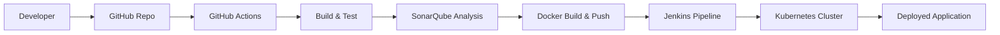

# ⚙️ End-to-End CI/CD Pipeline with DevSecOps

## 📌 Overview

This project implements a **production-ready End-to-End CI/CD pipeline** integrating **DevSecOps practices** using GitHub Actions and Jenkins.

It automates the complete software delivery lifecycle:

* Build & Test
* Static Code Analysis (SAST)
* Containerization
* Security Scanning
* Deployment to Kubernetes

The solution ensures **secure, scalable, and automated deployments** across environments.

---

## 🚀 Architecture



---

## 🧠 Architecture Explanation

* **GitHub Actions** → CI trigger (build + test)
* **Jenkins** → CD orchestration
* **SonarQube** → Code quality + SAST
* **Docker** → Containerization
* **Kubernetes** → Deployment platform

---

## 🔧 Tech Stack

| Category      | Tools                   |
| ------------- | ----------------------- |
| CI/CD         | GitHub Actions, Jenkins |
| Containers    | Docker                  |
| Orchestration | Kubernetes              |
| Security      | SonarQube               |
| SCM           | Git, GitHub             |
| Scripting     | YAML, Shell             |

---

## 📂 Project Structure

```
end-to-end-cicd-devsecops-pipeline/
│
├── app/
│   ├── Dockerfile
│   └── app.py
│
├── jenkins/
│   └── Jenkinsfile
│
├── k8s/
│   ├── deployment.yaml
│   ├── service.yaml
│   └── ingress.yaml
│
├── .github/
│   └── workflows/
│       └── cicd-pipeline.yml
│
└── README.md
```

---

## 🔄 CI/CD Pipeline Flow

1. Developer pushes code to GitHub
2. GitHub Actions pipeline triggers
3. Build & Unit Tests executed
4. SonarQube SAST & Quality Gate check
5. Docker image build
6. Image pushed to Docker Hub / ACR / ECR
7. Jenkins pipeline triggered
8. Deployment to Kubernetes
9. Application verification

---

## 🔐 DevSecOps Integration

* Static Code Analysis using SonarQube
* Quality Gate enforcement
* Secure Docker build
* Secrets managed via GitHub/Jenkins
* Optional: Container scanning (Trivy/Snyk)

---

# ⚙️ Setup Instructions

## 1️⃣ Prerequisites

* Git installed
* Docker installed
* Kubernetes cluster (AKS/EKS/Minikube)
* Jenkins server
* SonarQube server
* GitHub repository

---

## 2️⃣ Clone Repository

```bash
git clone https://github.com/atulkamble/end-to-end-cicd-devsecops-pipeline.git
cd end-to-end-cicd-devsecops-pipeline
```

---

## 3️⃣ GitHub Actions Workflow

### `.github/workflows/cicd-pipeline.yml`

```yaml
name: CI Pipeline

on:
  push:
    branches:
      - main

jobs:
  build:
    runs-on: ubuntu-latest

    steps:
    - name: Checkout Code
      uses: actions/checkout@v3

    - name: Set up Docker
      uses: docker/setup-buildx-action@v2

    - name: Build Docker Image
      run: docker build -t your-dockerhub-username/app:latest ./app

    - name: Login to DockerHub
      run: echo "${{ secrets.DOCKER_PASSWORD }}" | docker login -u "${{ secrets.DOCKER_USERNAME }}" --password-stdin

    - name: Push Image
      run: docker push your-dockerhub-username/app:latest
```

---

## 4️⃣ Jenkins Pipeline

### `jenkins/Jenkinsfile`

```groovy
pipeline {
    agent any

    environment {
        IMAGE = "your-dockerhub-username/app:latest"
    }

    stages {

        stage('Checkout') {
            steps {
                git 'https://github.com/<your-username>/end-to-end-cicd-devsecops-pipeline.git'
            }
        }

        stage('SonarQube Scan') {
            steps {
                sh 'sonar-scanner'
            }
        }

        stage('Deploy to Kubernetes') {
            steps {
                sh 'kubectl apply -f k8s/'
            }
        }
    }
}
```

---

## 5️⃣ Kubernetes Deployment

### `k8s/deployment.yaml`

```yaml
apiVersion: apps/v1
kind: Deployment
metadata:
  name: devsecops-app
spec:
  replicas: 2
  selector:
    matchLabels:
      app: devsecops-app
  template:
    metadata:
      labels:
        app: devsecops-app
    spec:
      containers:
      - name: app
        image: your-dockerhub-username/app:latest
        ports:
        - containerPort: 5000
```

---

### `k8s/service.yaml`

```yaml
apiVersion: v1
kind: Service
metadata:
  name: devsecops-service
spec:
  type: LoadBalancer
  selector:
    app: devsecops-app
  ports:
    - port: 80
      targetPort: 5000
```

---

## 📊 Key Features

* Fully automated CI/CD pipeline
* DevSecOps integration
* Kubernetes deployment
* Scalable architecture
* Production-ready design

---

## 📈 Outcomes

* Faster deployment cycles
* Improved release quality
* Automated security validation
* Reduced manual intervention

---

## 🚀 Future Enhancements

* Add Helm charts
* Multi-environment pipeline (Dev/Staging/Prod)
* Add DAST (OWASP ZAP)
* Integrate Trivy for container scanning
* Implement HPA (Auto Scaling)

---

## 👨‍💻 Author

**Atul Kamble**
Cloud & Platform Architect | DevOps | SRE | Kubernetes | Terraform
